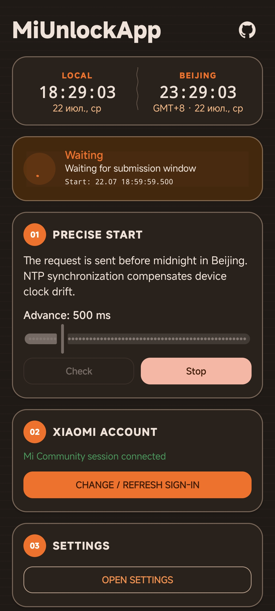
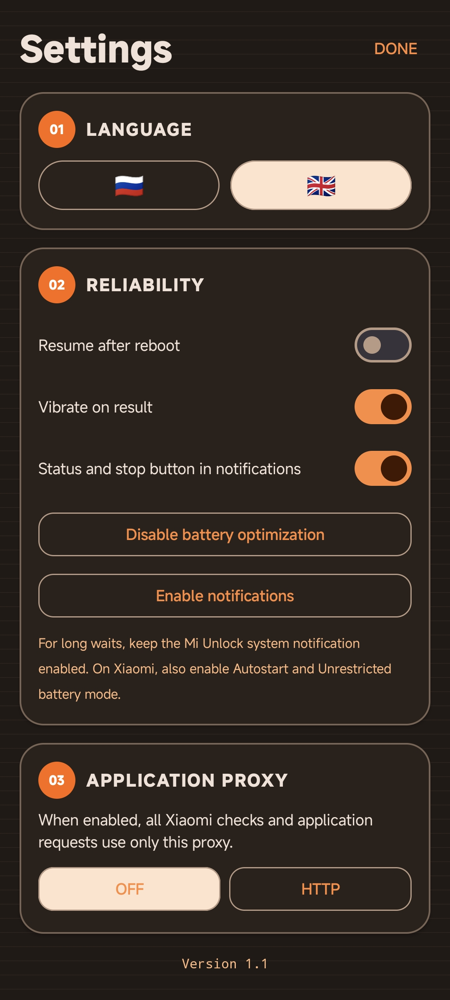

# MiUnlockApp

**A simple companion for preparing a Xiaomi bootloader-unlock application.**

> [!IMPORTANT]
> MiUnlockApp is an independent app and is not affiliated with Xiaomi. It helps prepare and send the standard application, but Xiaomi decides whether to grant access.

## Screenshots

  
  

## What It Does

- Sign in with a Xiaomi Account directly in the app.
- Check whether the account is ready for an unlock application.
- Wait for the right time and send the application automatically.
- Stay active in the background with the screen off.
- Show a live status in notifications, including a stop button.
- Display Russian or English with one tap.
- Keep account details on the device only.

## Install

1. Download the latest APK from **Releases**.
2. Allow installation from the app you used to download the file.
3. Install and open MiUnlockApp.

## How To Use

1. Open **Settings** and tap **Enable notifications**.
2. Tap **Disable battery optimization** and allow it.
3. On Xiaomi phones, also allow Autostart and set battery use to **No restrictions**.
4. Return to the main screen and sign in to your Xiaomi Account.
5. Tap **Check** to see the account status.
6. Tap **Start** when the account is ready.
7. The app keeps working in the background. The notification shows its current status and lets you stop it at any time.

## Important

- Use the app only with your own Xiaomi Account.
- Keep your phone connected to the internet while it is waiting.
- Do not close the app from the recent-apps screen while it is working.
- The final decision and any waiting period are controlled by Xiaomi.

## Privacy

- Your password is used only while you sign in and is not saved.
- The app keeps the session needed for the application on your device.
- Your account details are not sent to third-party services.

## License

This project is available under the [MIT License](LICENSE).

Made for Android with ChatGPT 5.6 Terra ❤️

