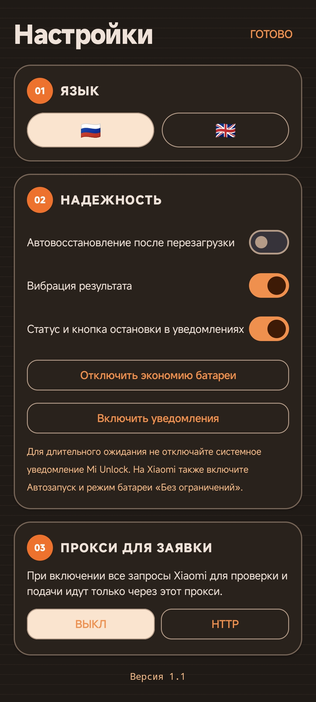

# MiUnlockApp

**Простое приложение для подготовки заявки на разблокировку загрузчика Xiaomi.**

> [!IMPORTANT]
> MiUnlockApp - независимое приложение и не связано с Xiaomi. Оно помогает подготовить и отправить обычную заявку, но решение о выдаче доступа принимает Xiaomi.

## Скриншоты

  
  

## Возможности

- Вход в Xiaomi Account прямо в приложении.
- Проверка, готов ли аккаунт к подаче заявки.
- Ожидание нужного времени и автоматическая отправка заявки.
- Работа в фоне и с выключенным экраном.
- Постоянный статус в уведомлениях и кнопка остановки.
- Переключение между русским и английским языком одним нажатием.
- Данные аккаунта остаются на устройстве.

## Установка

1. Скачайте последний APK из раздела **Releases**.
2. Разрешите установку приложений из источника, которым был скачан файл.
3. Установите и откройте MiUnlockApp.

## Как пользоваться

1. Откройте **Настройки** и нажмите **Включить уведомления**.
2. Нажмите **Отключить экономию батареи** и подтвердите разрешение.
3. На Xiaomi также включите Автозапуск и режим батареи **Без ограничений**.
4. Вернитесь на главный экран и войдите в Xiaomi Account.
5. Нажмите **Проверить**, чтобы узнать состояние аккаунта.
6. Если аккаунт готов, нажмите **Запустить**.
7. Приложение продолжит работу в фоне. В уведомлении виден текущий статус и кнопка остановки.

## Важно

- Используйте приложение только со своим Xiaomi Account.
- Пока приложение ждёт, телефон должен быть подключен к интернету.
- Не закрывайте приложение через список последних приложений во время работы.
- Итоговое решение и срок ожидания устанавливает Xiaomi.

## Конфиденциальность

- Пароль используется только во время входа и не сохраняется.
- Нужная для заявки сессия хранится только на устройстве.
- Данные аккаунта не отправляются сторонним сервисам.

## Лицензия

Проект распространяется по лицензии [MIT](LICENSE).

Сделано на Android с помощью ChatGPT 5.6 Terra ❤️

